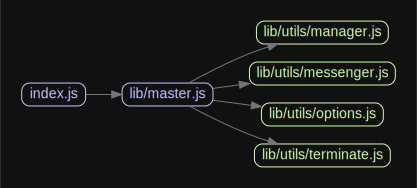

# 源码分析

主要是提供startCluster方法给egg-script start和egg-bin dev去调用。
封装了agent/app/master进程间通信和关系。

## 文件结构

``` bash
/Users/liufang/openSource/FunnyLiu/egg-cluster
├── index.js - 暴露startCluster方法，使用lib/master.js的ready()
├── lib
|  ├── agent_worker.js - fork agent进程时具体做的事情
|  ├── app_worker.js - fork app进程时具体做的事情，主要是参数拼接和日志初始化。通过原生http模块创建server
|  ├── master.js - 控制fork，并管理进程间通信和细节
|  └── utils
|     ├── manager.js - 管理进程worker
|     ├── messenger.js - 负责通信
|     ├── options.js - 负责参数组装
|     └── terminate.js

```

## 外部模块依赖

请在： http://npm.broofa.com?q=egg-cluster 查看

## 内部模块依赖



## 逐个文件分析

### index.js

暴露startCluster方法，使用lib/master.js的ready()
  
### lib/master.js

继承自原生events模块。使用lib/utils/options.js来解析参数。
使用lib/utils/manager.js来管理worker，使用lib/utils/messenger.js来和子进程app/agent通信。

通过forkAppWorkers()和forkAgentWorker()来fork app 和agent的子进程。具体的fork app 的工作基于cfork模块，而agent则直接是原生child_process模块

其中执行app和agent的具体内容存在于lib/app_worker.js和lib/agent_worker.js。

### lib/app_worker.js

fork app进程时具体执行的内容。

拼接参数和日志相关，基于http模块创建server。

### lib/utils/options.js

提供方法解析参数。

参数校验，大量使用原生assert模块来对参数进行校验。

### lib/utils/manager.js

提供类Manager，继承自EventEmitter。用于管理worker，提供一些列api。

### lib/utils/messenger.js

监听通信，根据to类型，给master/worker/agent分别通信。

master是基于传入的master类，以事件方式通信。

worker和agent则是通过sendmessage模块对其通信。

# egg-cluster

[![NPM version][npm-image]][npm-url]
[![build status][travis-image]][travis-url]
[![Test coverage][codecov-image]][codecov-url]
[![David deps][david-image]][david-url]
[![Known Vulnerabilities][snyk-image]][snyk-url]
[![npm download][download-image]][download-url]

[npm-image]: https://img.shields.io/npm/v/egg-cluster.svg?style=flat-square
[npm-url]: https://npmjs.org/package/egg-cluster
[travis-image]: https://img.shields.io/travis/eggjs/egg-cluster.svg?style=flat-square
[travis-url]: https://travis-ci.org/eggjs/egg-cluster
[codecov-image]: https://codecov.io/github/eggjs/egg-cluster/coverage.svg?branch=master
[codecov-url]: https://codecov.io/github/eggjs/egg-cluster?branch=master
[david-image]: https://img.shields.io/david/eggjs/egg-cluster.svg?style=flat-square
[david-url]: https://david-dm.org/eggjs/egg-cluster
[snyk-image]: https://snyk.io/test/npm/egg-cluster/badge.svg?style=flat-square
[snyk-url]: https://snyk.io/test/npm/egg-cluster
[download-image]: https://img.shields.io/npm/dm/egg-cluster.svg?style=flat-square
[download-url]: https://npmjs.org/package/egg-cluster

Cluster Manager for Egg

---

## Install

```bash
$ npm i egg-cluster --save
```

## Usage

```js
const startCluster = require('egg-cluster').startCluster;
startCluster({
  baseDir: '/path/to/app',
  framework: '/path/to/framework',
});
```

You can specify a callback that will be invoked when application has started. However, master process will exit when catch an error.

```js
startCluster(options, () => {
  console.log('started');
});
```

## Options

| Param        | Type      | Description                              |
| ------------ | --------- | ---------------------------------------- |
| baseDir      | `String`  | directory of application                 |
| framework    | `String`  | specify framework that can be absolute path or npm package |
| plugins      | `Object`  | plugins for unittest                     |
| workers      | `Number`  | numbers of app workers                   |
| sticky       | `Boolean` | sticky mode server                       |
| port         | `Number`  | port                                     |
| https        | `Object`  | start a https server, note: `key` / `cert` / `ca` should be full path to file |
| require      | `Array\|String` | will inject into worker/agent process |
| pidFile      | `String`  | will save master pid to this file |

## Env

EGG_APP_CLOSE_TIMEOUT: app worker boot timeout value

EGG_AGENT_CLOSE_TIMEOUT: agent worker boot timeout value

## License

[MIT](LICENSE)
